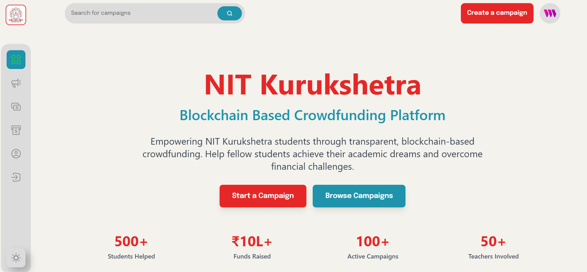

# 🎓 NIT Kurukshetra - Blockchain Crowdfunding Platform

[](https://your-vercel-url.vercel.app)
[](https://github.com/akshit3031/College-Crowdfunding-Project-2)
[](https://reactjs.org/)
[](https://soliditylang.org/)

## 📸 Platform Overview

<div align="center">

### Landing Page


### Platform Features


### Create Campaign


### Browse Campaigns


### Fund Campaign


### Withdrawal Management


</div>

---

A modern, transparent, and secure blockchain-based crowdfunding platform specifically designed for NIT Kurukshetra students. This decentralized application enables students to create fundraising campaigns for educational expenses, medical emergencies, and academic projects while ensuring complete transparency through blockchain technology.

## 🌟 Features

### 🔐 **Blockchain Security**
- Smart contract-based fund management
- Transparent transaction history
- Immutable records on Ethereum blockchain
- Secure wallet integration via MetaMask

### 👥 **Role-Based Access Control**
- **Students**: Create campaigns, request withdrawals
- **Teachers**: Approve withdrawal requests
- **Admin**: Manage teacher permissions
- **Contributors**: Donate to campaigns anonymously

### 💰 **Advanced Campaign Management**
- Create detailed fundraising campaigns
- Set target amounts and deadlines
- Real-time funding progress tracking
- Campaign image and document uploads

### 🏛️ **Institutional Features**
- NIT Kurukshetra branding and theming
- Teacher approval system for withdrawals
- Multi-signature-like approval process
- Educational expense categorization

### 📱 **Modern UI/UX**
- Fully responsive design
- Mobile-optimized interface
- Professional institutional styling
- Intuitive user experience

## � Application Screenshots

### 1. Landing Page

*Welcome page introducing the NIT Kurukshetra Crowdfunding Platform*

### 2. Landing Page - Features

*Detailed features and benefits of the platform*

### 3. Start Campaign

*Create new fundraising campaigns with detailed information*

### 4. All Campaigns

*Browse and discover all active fundraising campaigns*

### 5. Fund Campaign

*Campaign details and donation interface*

### 6. All Withdrawals

*Teacher dashboard for managing withdrawal requests*

## �🛠️ Technology Stack

### **Frontend**
- **React 18** - Modern UI library
- **Vite** - Fast build tool and development server
- **Tailwind CSS** - Utility-first CSS framework
- **React Router** - Client-side routing
- **Responsive Design** - Mobile-first approach

### **Blockchain**
- **Solidity** - Smart contract programming
- **Truffle Suite** - Development framework
- **Ganache** - Local blockchain for testing
- **OpenZeppelin** - Secure contract libraries
- **Web3.js/Ethers.js** - Blockchain interaction

### **Development Tools**
- **MetaMask** - Wallet integration
- **IPFS** - Decentralized file storage
- **Vercel** - Frontend deployment
- **Git** - Version control

## 🚀 Live Demo

🌐 **[View Live Application](https://your-vercel-url.vercel.app)**

### Demo Accounts
- **Admin**: Manage teachers and system settings
- **Teacher**: Approve withdrawal requests
- **Student**: Create campaigns and request funds

## 📁 Project Structure

```
project_crowdfunding-master/
├── client/                 # React frontend application
│   ├── src/
│   │   ├── components/     # Reusable UI components
│   │   ├── pages/         # Application pages
│   │   ├── context/       # React context for state management
│   │   ├── assets/        # Images and static files
│   │   └── constants/     # Configuration and constants
│   ├── public/            # Public assets
│   └── package.json       # Frontend dependencies
├── web3/                  # Smart contracts and blockchain
│   ├── contracts/         # Solidity smart contracts
│   ├── migrations/        # Deployment scripts
│   ├── test/             # Contract tests
│   └── truffle-config.js  # Truffle configuration
├── docs/                  # Documentation
├── SIMULATION_GUIDE.md    # Local testing guide
├── VERCEL_DEPLOYMENT.md   # Deployment instructions
└── README.md             # This file
```

## 🔧 Installation & Setup

### Prerequisites
- Node.js (v16 or higher)
- npm or yarn
- MetaMask browser extension
- Git

### 1. Clone Repository
```bash
git clone https://github.com/akshit3031/College-Crowdfunding-Project-2.git
cd College-Crowdfunding-Project-2
```

### 2. Install Dependencies
```bash
# Install frontend dependencies
cd client
npm install

# Install blockchain dependencies
cd ../web3
npm install
```

### 3. Setup Local Blockchain
```bash
# Install Ganache CLI
npm install -g ganache

# Start local blockchain
ganache --deterministic --accounts 10 --host 0.0.0.0 --port 8545
```

### 4. Deploy Smart Contracts
```bash
# From web3 directory
truffle migrate --network development
```

### 5. Configure MetaMask
- Add Custom Network: `http://127.0.0.1:8545`
- Chain ID: `1337`
- Import accounts from Ganache

### 6. Start Frontend
```bash
# From client directory
npm run dev
```

Visit `http://localhost:5173` to access the application.

## 📋 Usage Guide

### For Students
1. **Connect Wallet** - Link MetaMask to the platform
2. **Create Campaign** - Fill campaign details and upload documents
3. **Share Campaign** - Promote to potential donors
4. **Request Withdrawal** - Submit withdrawal requests with justification
5. **Receive Funds** - Get approved funds directly to wallet

### For Teachers
1. **Access Admin Panel** - Login with teacher account
2. **Review Requests** - View all pending withdrawal requests
3. **Verify Documentation** - Check submitted justifications
4. **Approve/Reject** - Make decisions on withdrawal requests
5. **Monitor System** - Track overall platform activity

### For Contributors
1. **Browse Campaigns** - Explore active fundraising campaigns
2. **View Details** - Check campaign progress and documentation
3. **Make Donations** - Contribute ETH to chosen campaigns
4. **Track Impact** - Monitor how funds are being used

## 🔒 Security Features

- **Smart Contract Audited** - Secure fund management
- **Multi-signature Approvals** - Teacher verification required
- **Immutable Records** - All transactions permanently recorded
- **Access Control** - Role-based permissions
- **Wallet Security** - MetaMask integration for secure transactions

## 🌐 Deployment

### Vercel (Frontend)
```bash
# Build for production
npm run build

# Deploy to Vercel
vercel --prod
```

### Blockchain Networks
- **Development**: Local Ganache
- **Testnet**: Polygon Mumbai (for testing)
- **Mainnet**: Polygon/Ethereum (for production)

## 📊 Smart Contract Details

### CollegeCampaignFactory.sol
- Creates new campaign contracts
- Manages teacher permissions
- Maintains campaign registry

### CollegeCampaign.sol
- Individual campaign logic
- Donation handling
- Withdrawal request management
- Fund distribution

### Key Functions
- `createCampaign()` - Deploy new campaign
- `donate()` - Contribute to campaign
- `requestWithdrawal()` - Request fund withdrawal
- `approveWithdrawal()` - Teacher approval
- `finalizeWithdrawal()` - Complete fund transfer

## 🎯 Future Enhancements

- [ ] **Mobile App** - React Native implementation
- [ ] **Email Notifications** - Campaign updates
- [ ] **Advanced Analytics** - Funding insights
- [ ] **Multi-token Support** - Accept different cryptocurrencies
- [ ] **KYC Integration** - Identity verification
- [ ] **Recurring Donations** - Subscription-based giving

## 🤝 Contributing

1. Fork the repository
2. Create feature branch (`git checkout -b feature/amazing-feature`)
3. Commit changes (`git commit -m 'Add amazing feature'`)
4. Push to branch (`git push origin feature/amazing-feature`)
5. Open Pull Request

## 📄 License

This project is licensed under the MIT License - see the [LICENSE](LICENSE) file for details.

## 👥 Team

- **Developer**: [Akshit Garg](https://github.com/akshit3031)
- **Institution**: National Institute of Technology, Kurukshetra
- **Project Type**: Blockchain Development


---

<div align="center">
  <p><strong>Made with ❤️ for NIT Kurukshetra Students</strong></p>
  <p>Empowering education through blockchain technology</p>
</div>

## 📚 Additional Resources

- [Simulation Guide](SIMULATION_GUIDE.md) - Local testing instructions
- [Vercel Deployment](VERCEL_DEPLOYMENT.md) - Production deployment guide
- [Smart Contract Documentation](web3/README.md) - Detailed contract information
- [Frontend Documentation](client/README.md) - React app details

---

[](https://github.com/akshit3031/College-Crowdfunding-Project-2)
[](https://nitkkr.ac.in)
